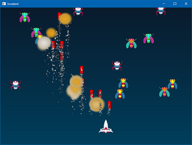

# gl-invaders

Small spaceshooter game written in C++ using OpenGL.

It is a clone/rewrite of the game that Jon Blow showed on his first Jai programming language [demo](https://www.youtube.com/watch?v=UTqZNujQOlA&t=5504s).

I liked the game and his implementation. Since I don't have a Jai compiler I decided to try and remake it in C++.

> **Caution:** Lots of Bugs! (in game and in code!)

---

## Screenshot

## Technologies

- C++
- OpenGL
- Win32 API
- stb_image (for loading PNG images)
